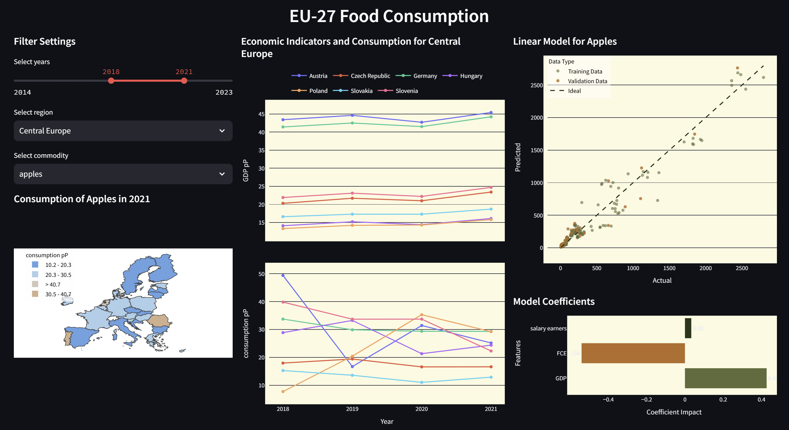

# eu27_food_consumption
This project is a visual exploration of economic and food consumption data of EU27. It is part of the course Visual Data Science at TU Vienna.

## Project Idea
The aim of the project is to examine patterns of food consumption of selected products across all 27 EU member states. It investigates regional and temporal trends and compares food consumption data with economic indicators, such as private expenditure or gross domestic product, to identify possible correlations. The data could reveal wether increased private spending leads to increased food consumption or wether the money is spent elsewhere, for instance. It will also be interesting to see if there are regional clusters for certain products, such as milk or apples. The research question could be formulated as follows: *How do economic factors influence food consumption patterns across EU member states, and what regional trends or clusters can be identified?*

## Usability
1. Install python version 3.13.1
2. Run `pip install -r requirements.txt`
3. Run `streamlit run app/app.py`

## Dashboard
In the Streamlit app you can filter for years, regions and commodities. The visualizations will give you an overview of the situation and the fit of the linear regression model for this commodity.

## Methodology
The project will be carried out in four steps. First, relevant data from the European Comission will be gathered and preprocessed using Pandas. The cleaned datasets will be merged into a comprehensive table. In the second step, the data will be visually explored to identify initial clusters or patterns. This will be continued in the third step, which is be all about modelling using scikit-learn. In this step, either a regression model will be applied, depending on the findings from the previous steps. Finally, the results will be presented through an interactive dashboard using Streamlit. The final product will include multiple visualizations and support interactivity to allow users to follow along with the analysis.

## Datasets

### 1. eu27_food_consumption
Source: Joint Research Centre, European Comission. 

Data Attributes:
- Country: EU member states
- Commodity: Apples, barley, butter, milk, oats, soybean, sunflower and wine
- Year: 2014-2024
- Apparent Use: Total consumption estimate (in 1000 tonnes/hectolitres)
- Apparent Use per Capita: Normalized by population (in kg or litres per person)
- Harvested Area (in 1000 hectares)
- Self Sufficiency: Ratio of production to consumption (ratio)
- Yield: Output per unit area (in tonnes/hectolitres per hectar)

### 2. eu27_economic_data
Source: Eurostat via AMECO database, European Comission.

Data Attributes:
- Country: EU member states
- Year: 2014-2024
- GDP: Gross domestic product (in Mrd. ECU/EUR)
- GDP per Head: normalized by population (in 1000 EUR)
- Private FCE: Final Consumption Expenditure (in Mrd. ECU/EUR)
- Wage and Salary earners: Numbers of persons employed (in persons)

## References

Joint Research Centre. (2018). EU estimated agricultural balance sheets [Data set]. European Commission, Joint Research Centre. Retrieved November 15, 2024, from http://data.europa.eu/89h/33243e5e-44a1-4b43-9444-31d64dc7921f

Eurostat. (n.d.). AMECO database [Data set]. European Commission, Eurostat. Retrieved November 15, 2024, from https://economy-finance.ec.europa.eu/economic-research-and-databases/economic-databases/ameco-database_en
